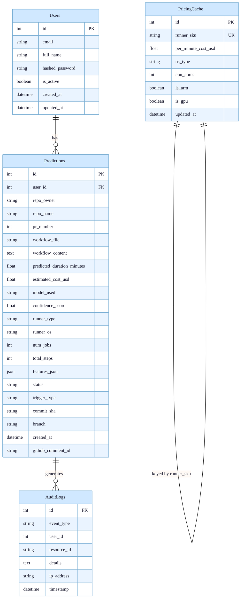

```mermaid
%%{init: {'theme': 'base', 'themeVariables': {'primaryColor': '#D0E8FF', 'primaryBorderColor': '#7BAFD4', 'primaryTextColor': '#1a1a2e', 'fontSize': '14px', 'fontFamily': 'Segoe UI, sans-serif'}}}%%

erDiagram

    Users {
        int id PK
        string email
        string full_name
        string hashed_password
        boolean is_active
        datetime created_at
        datetime updated_at
    }

    Predictions {
        int id PK
        int user_id FK
        string repo_owner
        string repo_name
        int pr_number
        string workflow_file
        text workflow_content
        float predicted_duration_minutes
        float estimated_cost_usd
        string model_used
        float confidence_score
        string runner_type
        string runner_os
        int num_jobs
        int total_steps
        json features_json
        string status
        string trigger_type
        string commit_sha
        string branch
        datetime created_at
        string github_comment_id
    }

    PricingCache {
        int id PK
        string runner_sku UK
        float per_minute_cost_usd
        string os_type
        int cpu_cores
        boolean is_arm
        boolean is_gpu
        datetime updated_at
    }

    AuditLogs {
        int id PK
        string event_type
        int user_id
        string resource_id
        text details
        string ip_address
        datetime timestamp
    }

    Users ||--o{ Predictions : "has"
    Predictions ||--o{ AuditLogs : "generates"
    PricingCache ||--|| PricingCache : "keyed by runner_sku"
```
