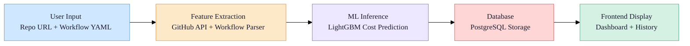

# System-Level Data Flow — Prediction Request Flow

```mermaid
%%{init: {'theme': 'base', 'themeVariables': {'primaryColor': '#D0E8FF', 'primaryBorderColor': '#7BAFD4', 'primaryTextColor': '#1a1a2e', 'fontSize': '14px', 'fontFamily': 'Segoe UI, sans-serif'}}}%%

flowchart LR

    A["User Input\nRepo URL + Workflow YAML"] --> B["Feature Extraction\nGitHub API + Workflow Parser"]
    B --> C["ML Inference\nLightGBM Cost Prediction"]
    C --> D["Database\nPostgreSQL Storage"]
    D --> E["Frontend Display\nDashboard + History"]

    classDef primary fill:#D0E8FF,stroke:#7BAFD4,color:#1a1a2e
    classDef secondary fill:#D4F1E4,stroke:#6DBF9E,color:#1a1a2e
    classDef accent fill:#FDE8C8,stroke:#E8A96A,color:#1a1a2e
    classDef warning fill:#FFD6D6,stroke:#E07B7B,color:#1a1a2e
    classDef neutral fill:#EDE8FF,stroke:#9C8FD4,color:#1a1a2e

    class A primary
    class B accent
    class C neutral
    class D warning
    class E secondary
```
