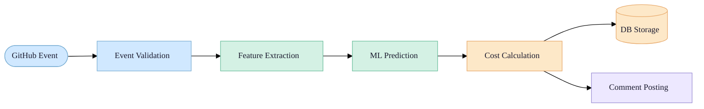

```mermaid
%%{init: {'theme': 'base', 'themeVariables': {'primaryColor': '#D0E8FF', 'primaryBorderColor': '#7BAFD4', 'primaryTextColor': '#1a1a2e', 'fontSize': '14px', 'fontFamily': 'Segoe UI, sans-serif'}}}%%

flowchart LR

    GH_EVENT([GitHub Event]) --> VALIDATION[Event Validation]
    VALIDATION --> FEAT_EXTRACT[Feature Extraction]
    FEAT_EXTRACT --> ML_PRED[ML Prediction]
    ML_PRED --> COST_CALC[Cost Calculation]
    COST_CALC --> DB_STORE[(DB Storage)]
    COST_CALC --> COMMENT_POST[Comment Posting]

    classDef primary   fill:#D0E8FF,stroke:#7BAFD4,color:#1a1a2e
    classDef secondary fill:#D4F1E4,stroke:#6DBF9E,color:#1a1a2e
    classDef accent    fill:#FDE8C8,stroke:#E8A96A,color:#1a1a2e
    classDef neutral   fill:#EDE8FF,stroke:#9C8FD4,color:#1a1a2e

    class GH_EVENT,VALIDATION primary
    class FEAT_EXTRACT,ML_PRED secondary
    class COST_CALC,DB_STORE accent
    class COMMENT_POST neutral
```
